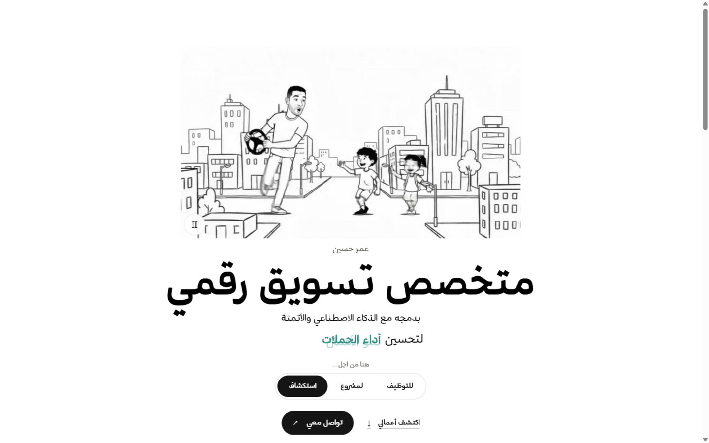
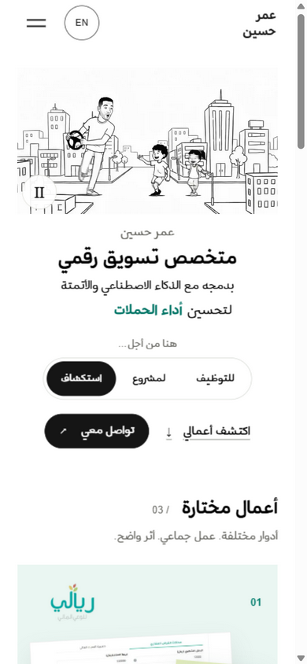

<div align="center">

# عمر حسين · Omar Hussien

**خبير التسويق الرقمي والأتمتة الذكية** — بورتفوليو شخصي

[العربية](#العربية) · [English](#english)

[](https://omar-hussein-portfolio.vercel.app/)
[](https://github.com/Omarhussien2/portfolio)
[](https://nextjs.org/)
[](https://www.typescriptlang.org/)
[](https://tailwindcss.com/)
[](https://vercel.com/)

<a href="https://omar-hussein-portfolio.vercel.app/">
  
</a>



</div>

---

## العربية

بورتفوليو شخصي لعمر حسين، خبير تسويق رقمي. الموقع **عربي أولًا** بتصميم RTL كامل، مع نسخة إنجليزية مكافئة تحت `/en`.

**زيارة الموقع:** <https://omar-hussein-portfolio.vercel.app/>

### المزايا

- **عربي أولًا** — العربية هي اللغة الأساسية والمسار الافتراضي، والإنجليزية تحت `/en` بمسار ومحتوى مكافئ. لا يوجد تحويل تلقائي حسب لغة المتصفح.
- **جوال أولًا** — التصميم يبدأ من الهاتف: بلا تمرير أفقي، أهداف لمس لا تقل عن 44px، وترتيب قراءة منطقي.
- **حركة محترمة** — تمرير سلس وحركات مبنية بـ Framer Motion و GSAP، مع احترام كامل لتفضيل `prefers-reduced-motion`.
- **ميديا واعية** — فيديوهات المشاريع لا تبدأ تلقائيًا؛ تُحمَّل وتُشغَّل بطلب المستخدم وتتوقف خارج الشاشة أو عند إخفاء الصفحة.
- **SEO لكل لغة** — بيانات وصفية مستقلة لكل لغة، مع `robots.txt` و `sitemap.xml`.
- **مصدر واحد للحقيقة** — كل نصوص المشاريع وأرقامها في ملف واحد: `src/data/projects.ts`.

### التقنيات

| الطبقة | التقنية |
| --- | --- |
| الإطار | Next.js 14 (App Router) + React 18 |
| اللغة | TypeScript 5 |
| التنسيق | Tailwind CSS 3 |
| الحركة | Framer Motion 11 · GSAP 3 · Lenis 1 |
| الاستضافة | Vercel |

### بنية المشروع

```
src/
├── app/
│   ├── [locale]/            # مسارات اللغات: ar (الافتراضي، RTL) و en (LTR)
│   │   └── work/[slug]/     # صفحات تفاصيل المشاريع
│   ├── work/[slug]/         # تحويلات إلى مسارات اللغات
│   ├── fonts.css            # خطوط الويب العربية (Mestika — نطاق عربي فقط)
│   ├── globals.css
│   ├── robots.ts
│   └── sitemap.ts
├── components/              # Header, HeroBanner, ProjectGrid, ProjectMedia, …
├── data/projects.ts         # المصدر الوحيد لنصوص المشاريع وأرقامها
├── hooks/
├── lib/                     # i18n · metadata · animations
└── middleware.ts            # توجيه اللغات
```

### التشغيل محليًا

يتطلب [Node.js](https://nodejs.org/) ‏18.17 أو أحدث.

```bash
npm install     # تثبيت الاعتمادات
npm run dev     # التطوير على http://localhost:3000
npm run build   # بناء الإنتاج
npm run start   # تشغيل نسخة الإنتاج
npm run lint    # فحص جودة الكود
```

---

## English

Personal portfolio of **Omar Hussien**, digital marketer — with AI and automation as tools within the work. The site is **Arabic-first** with full RTL design and an equivalent English version under `/en`.

**Live site:** <https://omar-hussein-portfolio.vercel.app/>

### Features

- **Arabic-first** — Arabic is the primary language and default route; English lives under `/en` with equivalent content and routing. No browser-language redirects.
- **Mobile-first** — designed from the phone up: no horizontal overflow, touch targets of at least 44px, and a logical reading order.
- **Respectful motion** — smooth scrolling and animations built with Framer Motion and GSAP, fully honoring `prefers-reduced-motion`.
- **Considerate media** — project videos never autoplay; they load and play on user request and pause off-screen or when the page is hidden.
- **Per-locale SEO** — independent metadata per language, plus `robots.txt` and `sitemap.xml`.
- **Single source of truth** — all project copy and metrics live in one file: `src/data/projects.ts`.

### Tech Stack

| Layer | Technology |
| --- | --- |
| Framework | Next.js 14 (App Router) + React 18 |
| Language | TypeScript 5 |
| Styling | Tailwind CSS 3 |
| Motion | Framer Motion 11 · GSAP 3 · Lenis 1 |
| Hosting | Vercel |

### Project Structure

```
src/
├── app/
│   ├── [locale]/            # Locale routes: ar (default, RTL) and en (LTR)
│   │   └── work/[slug]/     # Project detail pages
│   ├── work/[slug]/         # Redirects into the locale routes
│   ├── fonts.css            # Arabic web fonts (Mestika — Arabic-only range)
│   ├── globals.css
│   ├── robots.ts
│   └── sitemap.ts
├── components/              # Header, HeroBanner, ProjectGrid, ProjectMedia, …
├── data/projects.ts         # Single source of truth for projects & metrics
├── hooks/
├── lib/                     # i18n · metadata · animations
└── middleware.ts            # Locale routing
```

### Running Locally

Requires [Node.js](https://nodejs.org/) 18.17+.

```bash
npm install     # Install dependencies
npm run dev     # Develop on http://localhost:3000
npm run build   # Production build
npm run start   # Serve the production build
npm run lint    # Lint the code
```

---

<div align="center">

**[omar-hussein-portfolio.vercel.app](https://omar-hussein-portfolio.vercel.app/)**

© 2026 Omar Hussien · عمر حسين — Personal portfolio

</div>
